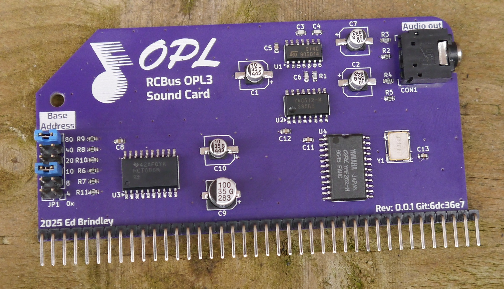

# RCBus OPL3 Sound card

An OPL3 sound card for RC2014/RCBus based computers, based on the Yamaha YMF262 and YAC512 ICs.

## Building the board
A site built from the sources is available https://electrified.github.io/rcbus-opl3-site. For Gerbers to get your own PCB manufactured see here, download the most appropriate zip for your PCB manufacturer: https://electrified.github.io/rcbus-opl3-site/Browse/rcbus-opl3-navigate_PCB_fabrication_gerber.html

### BOM
The BOM for the board is available here https://electrified.github.io/rcbus-opl3-site/Browse/rcbus-opl3-navigate_Schematic_BoM.html. The CSV version can be loaded into sites that have BOM upload functionality.

## Configuration
The base address the card is available at is configured with JP1 - the default setting which VGMPLAY expects is 0x90 - place jumpers on the 10 and 80 rows to achieve this

## VGM playback
A lightly altered version of Marco Maccaferri and J.B. Langston's CP/M VGMPLAY is available [here](https://github.com/electrified/vgmplay). This allows playback of VGM files containing OPL2 and OPL3 content.

### Sources of OPL2/OPL3 VGM music
[OPL Archive](https://opl.wafflenet.com/#AmigaX)  
OPL3 Archive zip [from this page](https://roudoudou.com/ACE-DL/) - files are names in 8.3 format  
[VGMRips OPL2](https://vgmrips.net/packs/chip/ym3812)  
[VGMRips OPL3](https://vgmrips.net/packs/chip/ymf262)  
[VGMRips full download packs](https://vgmrips.net/forum/viewtopic.php?t=496)  

## Known issues with rev 1
* YMF footprint too narrow
* 10uf cap footprints too large
* Pin 1 not indicated for oscillator
* Noise on startup before reset?
* Cutout for line out isn't quite deep enough for the jack to sit flush without removing a bit of the plastic

## Sponsorship
The initial prototype boards for this were provided by PCBWay. Many thanks!

## License
RCBus OPL3 Sound Card ©2025 by Ed Brindley is licensed under CC BY-SA 4.0. To view a copy of this license, visit https://creativecommons.org/licenses/by-sa/4.0/ 